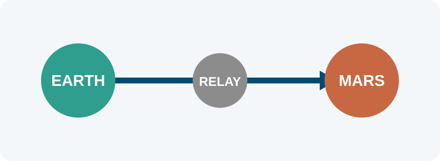

## Introduction

Our concept suggests that faster interplanetary mail can reduce mission risk,
lower dependence on online services, and support high-level calculations during
long-distance missions [@swift2024].

The idealized delivery speed is

$$
v(t) = \lim_{t \to \infty} \int_0^t c\sqrt{\tau^2}\,d\tau.
$$ {#eq-speed}

@eq-speed summarizes the asymptotic model used in this demonstration.

### Proven technology

A-Mail has consolidated several space programs. The prototype has recovered
letters lost in transit and demonstrated the value of dependable asynchronous
communication.

{#fig-network width=90%}

@fig-network shows the conceptual communication path used by the system.

### Limitless possibilities

Faster-than-light messaging creates opportunities for scientific collaboration
across distant settlements. The extension preserves ordinary Quarto features,
including citations, cross-references, equations, figures, lists, and tables.

| Capability | Role | Expected effect |
|---|---|---|
| Routing | Select a relay | Lower delay |
| Verification | Confirm receipt | Fewer losses |
| Prediction | Anticipate faults | Higher reliability |

: Example capabilities of the proposed mail system. {#tbl-capabilities}

## Conclusion

The converted format keeps the visual identity of `graceful-genetics` while
allowing authors to write the paper in Quarto Markdown and control front matter
through YAML metadata.
